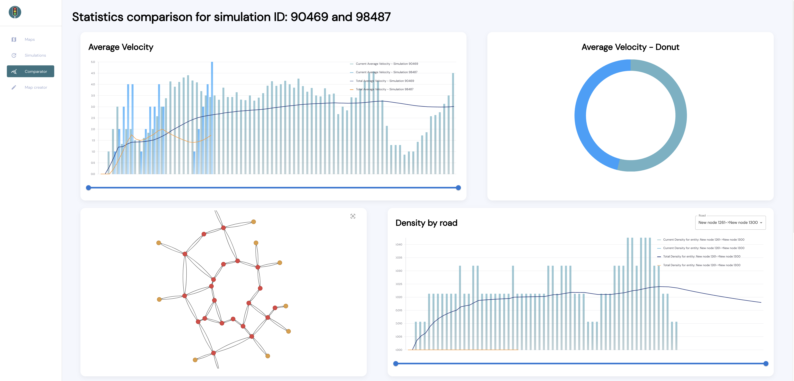

<h1 align="center">Kraksim</h1>

 

Kraksim is an environment for modeling and optimisation of road traffic. It gives you possibility to create maps and simulations and to collect the data about road traffic. You can also view and compare results of different simulations which take place on the same map.

 
 
 
<table>
<tr>
<th align="center">

</th>
<th align="center">

</th>
</tr>
<tr>
<td align="center">

</td>
<td align="center">

</td>
</tr>
</table>
 

Project was a part of Bachelor's degree thesis written in Polish, which can be red [here](docs/Bachelor's_degree_thesis.pdf)

Backend can be found [here](https://github.com/Kraksim/Kraksim)

### Setup

Use `nvm` for managing node versions (https://tecadmin.net/install-nvm-macos-with-homebrew/)

run `nvm install` to switch to appropriate npm version

### Running 

Set environment variable with link to backend instance, e.g. 
#### `export REACT_APP_API_URL=http://localhost:8081/`

then run 

#### `yarn start`

Open [http://localhost:3000](http://localhost:3000) to view it in the browser.
